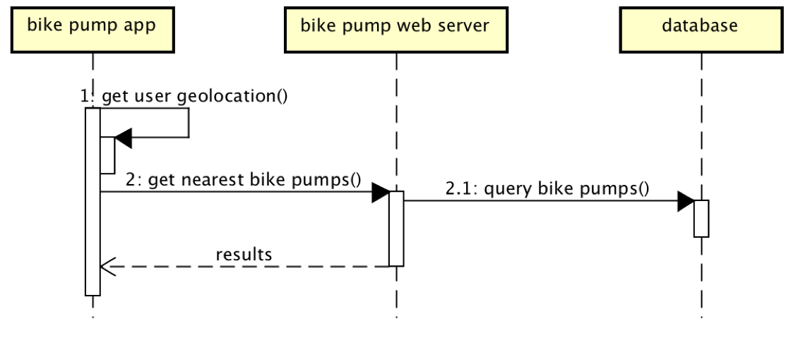

# Design

## Behavioural design
TODO: Describe a concrete scenario for each use-case. 
Describe it in terms of interactions between the components introduces above, and the actors introduced in your requirements.

## User Interface design
This is a wireframe for the Bike Pump Finder App. In this scenario the user can select "find bike pumps" that takes them to a table.

