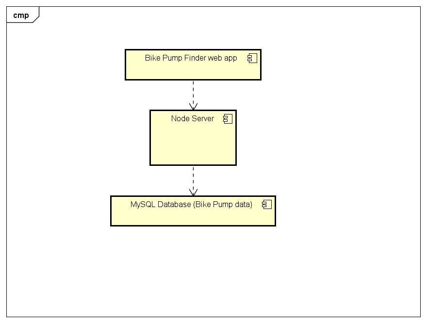

# Implementation

## Introduction
This is version v0.1 of the Bike Pump Finder application using Bristol Open Data's [Public Bike Pumps dataset](https://opendata.bristol.gov.uk/explore/dataset/public-bike-pumps/information/) containing 28 rows of data. It allows users to find local public tool stations and pumps to effect bike repairs on the go. There are no outstanding issues.

## Project Structure
TODO: Provide an outline of the project folder structure and the role of each file within it (not the contents of node_modules).
provide a table listing the number of jslint warnings/reports for each module.

## Software Architecture
TODO: Describe the major components of your architecture. Are any particular architectural styles being used?

