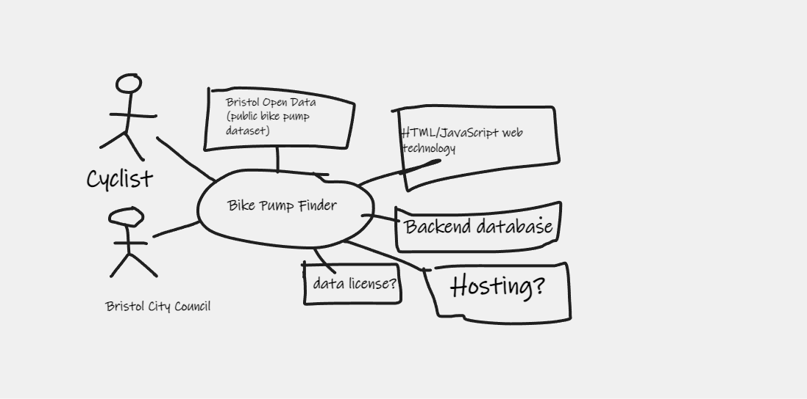

# Project Proposal

## Business Case

### Problem statement
Bristol City Council provides open data about **public bike pumps**. This app makes it possible for cyclists to find their nearest public tool and bike pump stations while they're on the go.

### Business benefits
- Cyclists don't need to carry their tools around with them all the time
* Support for cyclists who may get a puncture while they're out
* Provide specialist tools that cyclists may not own themselves

### Options Considered
* Bristol [Sustrans](https://www.sustrans.org.uk/) provides support for going car-free, including cycle network maps, including traffic-free route guides. This doesn't include public bike pumps.

### Expected Risks
* One risk is that the dataset may not continue to be available. This risk will be mitigated by saving a local copy of the data.

## Project Scope
This is the context diagram for the bike pump finder.
* _Cyclists_ are the users of the app
* _Bristol City Council_ provide the data
* Consider where the service will be _hosted_
* We may use a relational _backend database_
* Uses the _Public Bike Pump_ dataset on Bristol Open Data
* The app will be built using HTML / JavaScript technology
* Confirm that the data is publicly licensed

