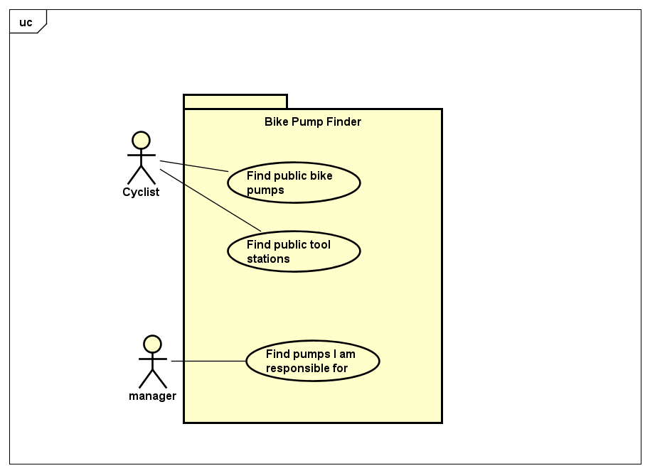

# Requirements

## User Needs

### User stories
* As a cyclist I want to be able to find public bike pumps in case I get a puncture.
* As a cyclist I need access to tools to change my inner tube
* As a bike rider I want to know where the nearest bike pumps are on my route so I can find them easily.
* As a UWE manager, I need to know what bike pumps we need to maintain on our premises.

### Actors
* **Cyclist**: A person who rides a bike for pleasure or for work.
* **Manager**: A person responsible for maintaining public bike pumps.

### Use Cases
TODO: Describe each use case (one per team member).
    Give each use case a unique ID, e.g. UC1, UC2, ...
    Summarise these using the use-case template below.

| UC1 | Find public bike pumps | 
| -------------------------------------- | ------------------- |
| **Description** | Find public bike pumps that are nearest to the user. |
| **Actors** | Cyclist |
| **Assumptions** | None |
| **Steps** | 1) get user location 2) query database for pump locations 3) list closest pumps |
| **Variations** | If user location isn't available, use a sensible default |
| **Non-functional** | 1) list 5 nearest pumps 2) don't list anything further than 5 miles away |
| **Issues** | None |

| TODO: USE-CASE ID e.g. UC1, UC2, ... | TODO: USE-CASE NAME | 
| -------------------------------------- | ------------------- |
| **Description** | TODO: Goal to be achieved by use case and sources for requirement |
| **Actors** | TODO: List of actors involved in use case |
| **Assumptions** | TODO: Pre/post-conditions if any</td></tr>
| **Steps** | TODO: Interactions between actors and system necessary to achieve goal |
| **Variations** | TODO: OPTIONAL - Any variations in the steps of a use case |
| **Non-functional** | TODO: OPTIONAL - List of non-functional requirements that the use case must meet. |
| **Issues** | TODO: OPTIONAL - List of issues that remain to be resolved |

| TODO: USE-CASE ID e.g. UC1, UC2, ... | TODO: USE-CASE NAME | 
| -------------------------------------- | ------------------- |
| **Description** | TODO: Goal to be achieved by use case and sources for requirement |
| **Actors** | TODO: List of actors involved in use case |
| **Assumptions** | TODO: Pre/post-conditions if any</td></tr>
| **Steps** | TODO: Interactions between actors and system necessary to achieve goal |
| **Variations** | TODO: OPTIONAL - Any variations in the steps of a use case |
| **Non-functional** | TODO: OPTIONAL - List of non-functional requirements that the use case must meet. |
| **Issues** | TODO: OPTIONAL - List of issues that remain to be resolved |

TODO: Your Use-Case diagram should include all use-cases.

## Software Requirements Specification
### Functional requirements
TODO: create a list of functional requirements. 
    e.g. "The system shall ..."
    Give each functional requirement a unique ID. e.g. FR1, FR2, ...
    Indicate which UC the requirement comes from.

<action><result><object>

* **FR1**: The system must get user location or default location if access is denied.
* **FR2**: The system must query for nearest pumps using the bike pump database
* **FR3**: The system must list closest pumps using query results

### Non-Functional Requirements
TODO: Consider one or more [quality attributes](https://en.wikipedia.org/wiki/ISO/IEC_9126) to suggest a small number of non-functional requirements.
Give each non-functional requirement a unique ID. e.g. NFR1, NFR2, ...

Indicate which UC the requirement comes from.
